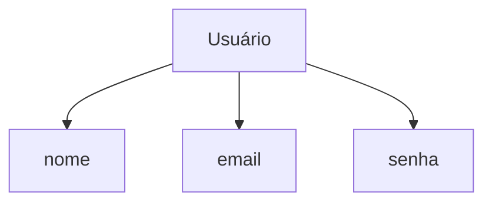
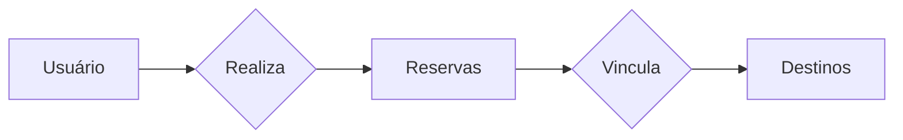

# Introdução a Banco de Dados Relacionais (SQL)

## Características
- Relacionamento entre tabelas
- Linguagem de consulta estruturada (SQL)
- Integridade referencial
- Normalização de dados
- Seguranças
- Flexibilidade e extensibilidade
- Suporte a transações ACID (**A**tomicidade - **C**onsistência - **I**solamento - **D**urabilidade)

## Organização da SQL

- DQL (Linguagem de consulta de dados)
  - SELECT
- DML (Linguagem de manipulação de dados)
  - INSERT, UPDATE, DELETE
- DDL (Linguagem de definição de dados)
  - CREATE, ALTER, DROP
- DCL (Linguagem de controle de dados)
  - GRANT, REVOKE
- DTL (Linguagem de transação de dados)
  - BEGIN, COMMIT, ROLLBACK

## Sintaxe básica

- nomes devem começar com uma letra ou um caracter de sublinhado
- sensibilidade a maiúsculas e minúsculas

## MER e DER
> O Modelo Entidade-Relacionamento(MER) é representado através de diagrams chamados Diagramas Entidade-Relacionamento(DER). 

### Entidades
As entidades são nomeadas com substantivos concretos ou abstratos que representam de forma clara sua função dentro do domínio.


### Atributos
São características ou propriedades das entidades. Descrevem informações específicas sobre uma entidade.



### Relacionamentos
Representam as associações entre entidades.



### Cardinalidade
- Relacionamento 1..1 (um pra um)
- Relacionamento 1..n ou 1..* (um para muitos)
- Relacionamento n..n ou *.. * (muitos para muitos)

## Modelagem de Dados Relacionais

### Tabelas
É usada para armazenar dados de forma organizada. Cada tabela tem um nome único e é dividida em colunas e linhas.

### Colunas
É uma estrutura dentro de uma tabela que representa um atributo específico dos dados armazenados.

### Registros
Também conhecido como linha ou tupla, é uma instância individual de dados em uma tabela.

### Tipos de dados
- Inteiro (Integer)
- Decimal/Numérico (Decimal/Numeric)
- Caractere/Varchar(Character/Varchar)
- Data/Hora(Date/Time)
- Booleano(Boolean)
- Texto longo (Text)

### Comando: CREATE TABLE
- Restrições de valor:
  - NOT NULL
  - UNIQUE
  - DEFAULT
- Chaves primárias e estrangeiras
- Auto incremento

### Operações CRUD
#### Comando: INSERT
```sql
INSERT INTO
{{nome - tabela}}
([coluna1, coluna2, ...])

VALUES
([valor-coluna1, valor-coluna2, ...])
```
#### Comando: SELECT
```sql
SELECT {{lista_colunas}}
FROM tabela;
```

```sql
SELECT {{lista_colunas}}
FROM tabela;
WHERE {{condicao}}
```
> Onde * retorna todas as colunas

#### Comando SELECT - Operadores
- = (igualdade)
- <> ou != (desigualdade)
- *>* (maior que)
- < (menor que)
- *>=* (maior igual)
- <= (menor igual)
- LIKE (comparação de padrões)
- IN (pertence a uma lista de valores)
- BETWEEN (dentro de um intervalo)
- AND (e lógico)
- OR (ou lógico) 

#### Comando: UPDATE
```sql
UPDATE {{tabela}}
SET
{{coluna_1}} = {{novo_valor_1}}
{{coluna_2}} = {{novo_valor_2}}
WHERE
{{condicao}};
```
#### Comando: DELETE
```sql
DELETE FROM
{{tabela}}
WHERE{{condicao}};
```

### Drop Table
É usado no SQL para remover uma tabela existente de um banco de dados relacional. **Ela exclui permanentemente a tabela.**
```sql
DROP TABLE {{tabela}}
```

### Alter Table
É usada no SQL para modificar a estrutura de uma tabela existente. Ela permite:
- Adicionar, alterar ou excluir colunas
- Modificar as retrições, índices
- Renomear a tabela


### Chave Primária
É um campo ou conjunto de campos que identifica exclusivamente cada registro em uma tabela. Ela garante a unicidade dos dados e é fundamental para estabelecer relações entre tabelas.
```sql
CREATE TABLE {{tabela}}
( ID PRIMARY KEY AUTINCREMENT, ...);
ALTER TABLE {{tabela}}
MODIFY COLUMN ID INT PRIMARY KEY;
```

### Chave Estrageira
Usada para estabelecer e manter a integridade dos dados entre tabelas relacionadas
- Pode ser nula (NOT NULL)
- É possível ter mais de uma(ou nenhuma) em uma tabela.
```sql
CREATE TABLE {{tabela}} (
id INT PRIMARY KEY,
chave_estrangeira INT,
FOREIGN KEY (chave_estrangeira) REFERENCES {{outra tabela}} (id)
);
```
**Restrições**
- ON DELETE especifica o que acontece com os registros dependentes quando um registro pai é exlcuido
- ON UPDATE define o comportamento dos registros dependentes quando um registro pai é atualizado
- CASCADE, SET NULL, SET DEFAULT e RESTRICT

## Normalização de Dados
É um processo no qual se organiza e estrutura um banco de dados relacional de forma a eliminar redundâncias e anomalias, garantindo a conssitência e e integridade dos dados.

### Formas Normais
- 1FN:garante que cada valor seja atômico e que os registros sejam únicos e indentificáveis.
- 2FN: garanter que os atributos não-chave dependam totalmente da chave primária, evitando dependências parciais.
- 3FN: elimina dependências transitivas entre os atributos não chave, garantindo que cada atributo não chave dependa apenas da chave primária, não havendo dependêncis indiretas entre eles.

## Consultas
### Junções: Tipos
- INNER JOIN
- LEFT JOIN ou LEFT OUTER JOIN
- RIGHT JOIN ou RIGHT OUTER JOIN
- FULL JOIN ou FULL OUTER JOIN


### INNER JOIN
Retorna apenas as linhas que têm correspondência em **ambas** as tabelas envolvidas. A junção é feita com base em uma condição e igualdaded especificada na cláusula ON.

```sql
SELECT *
FROM tabela1
INNER JOIN tabela2 ON tabela1.coluna = tabela2.coluna;
```


### LEFT JOIN
Retorna todas as linhas da tabela a esquerda da junção e as linhas correspondentes da tabela a direta. Se não houver correspondência, os valores a direita serão NULL.

```sql
SELECT *
FROM tabela1
LEFT JOIN tabela2 ON tabela1.coluna = tabela2.coluna;
```


### RIGHT JOIN
Retorna todas as linhas da tabela a direita da junção e as linhas correspondentes da tabela a esquerda. Se não houver correspondência, os valores a esquerda serão NULL.

```sql
SELECT *
FROM tabela1
RIGHT JOIN tabela2 ON tabela1.coluna = tabela2.coluna;
```


### FULL JOIN
Retorna todas as linhas de ambas as tabelas envolvidas na junção, combinando-as com base em uma condição de igualdade. Se não houver correspondência, os valores ausentes serão preenchidos com NULL.

```sql
SELECT *
FROM tabela1
FULL JOIN tabela2 ON tabela1.coluna = tabela2.coluna;
```


### Sub Consultas
Permitem realizar consultas mais complexas permitindo que você use o resultado de uma consulta como entrada para outra consulta.
- SELECT
- FROM
- WHERE
- HAVING
- JOIN

## Funções Agregadas
- COUNT: conta o número de registros
- SUM: soma os valores de uma coluna numérica
- AVG: calcula a média dos valores de uma coluna numérica
- MIN: retorna o valor mínimo de uma coluna
- MAX: retorna o valor mãximo de uma coluna

## Análise do Plano de Execução
Permite examinar as operações realizadas, as tabelas acessadas, os índices utilizados e ouitras informações importantes para indentificar possíveis melhorias no desempenho.
- select_type: SIMPLE, SUBQUERY, JOIN
- table
- type: ALL, INDEX entre outros
- possible_keys: os índices possíveis que podem ser utilizados na operação
- key: o índice utilizado na operação, se aplicável
- key_len: o comprimento do índice utilizado
- ref: as colunas ou constantes usadas para acessar o índice
- rows